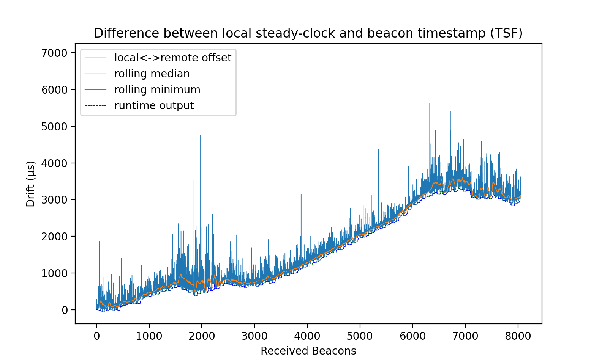

*DRAFT*

# Cooperative Wifi 5 TDMA protocol

This is a lightweight quick and dirty cooperative TDMA protocol implementation using linux `qdisc/plug` scheduler. It is meant to reduce ping variance on uncongested but high utilization wifi networks.


## Executive Summary

Wifi5 implements [CSMA/CA](https://en.wikipedia.org/wiki/Carrier-sense_multiple_access_with_collision_avoidance), which is a fundamentally stochastic protocol to avoid collisions; this means that by design, when we are near link capacity, the performance of the whole system can be severely degraded.

If you have an AP with high bandwidth (e.g. Netmetal 5 with 800Mbps) and you control a finite number of clients connecting to this AP, you can implement a cooperative TDMA schema where each client is configured locally to stay quiescent for a fixed period of time. Ideally, if you rate limit the clients to 1/N the slots available (e.g. 100Mbps for 8 clients each), it will transparently look like a 100Mbps link.

## Shortcomings

### Cooperateive

This scheme is like cooperative multi-tasking: if all players don't cooperate, performance is drastically reduced for those who do.

### `qdisc plug` is a suggestion

When a retransmission occurs due to a collision, it is at the hardware level and the packet will be retransmitted whenever the CSMA/CA protocol allows; the retransmission is outside the control of the kernel's plugin functionality. As a result, all timing bets are off for retransmissions; this means that if a retransmission occurs it will likely trigger a cascade of cross-slot collisions.


## Working details

The working idea is that we utilize the 802.11 beacon frames to synchronize all clients, and each client gets locally configured with the number of time slots available, and which timeslot it occupies. For now, the hub is left unchanged and gets to do whatever it wants [Note that this will be updated in an upcoming PR].

Example timing of a single client:

```
     beacon frame                                                                   next beacon
-------------------###-----------------------------------------------------------------###------------
                     |          |          |          |          |          |          |
         TDMA epochs       0         1           2         3          ...        N
```

Epochs 0 and N are special in that the beacon frame arrival is "a bit" stochastic. We treat them specially.


Inside each TDMA epoch, the clients volountarily stay quiet until their configured turn comes:

```
    epoch start                                                                           epoch end
---------##----------------------------------------------------------------------------------##-------
          |    |        |        |        |        |        |        |        |        |     |
slots     XXXXX    0         1       2        3        4         5       ...      M     XXXXXX

```

Each client gets assigned a slot number, as well as slot duration.

## Specific challenges

### Performance considerations

We want to maintain a high enough granularity that ping isn't affected more then 5ms on an uncongested network. This means that TDMA epochs should not be much more then 5ms-10ms.

However, the shorter the TDMA epoch, the more we are prone to transmission collisions caused by local clock jitter.

### Time synchronization

We rely on beacon frames to cross synchronize the clients (which may not be able to see each other physically). Between the clients and the AP, clocks will drift considerably over time and therefore we require constantly tracking beacon frames' timing. In between beacon frames we operate on dead reckoning and therefore we will be affected by the local clocks' jitter.

On local tests running [Mikrotik SXT sq 5AC](https://openwrt.org/toh/hwdata/mikrotik/mikrotik_sxtsq_5_ac_rbsxtsqg-5acd) (ipq40xx-mikrotik-mikrotik_sxtsq-5-ac) on client and [Netmetal 5](https://openwrt.org/toh/hwdata/mikrotik/mikrotik_rb911-2hn_911_lite2) (ath79-mikrotik-mikrotik_routerboard-911g-5hpacd), beacon drift is in annecdotally in the double digit microseconds, sometimes reaching hundreds of microseconds.


## Real-world results

Example timing drift between AP and clients.


See [results](./RESULTS.md) for more details.
